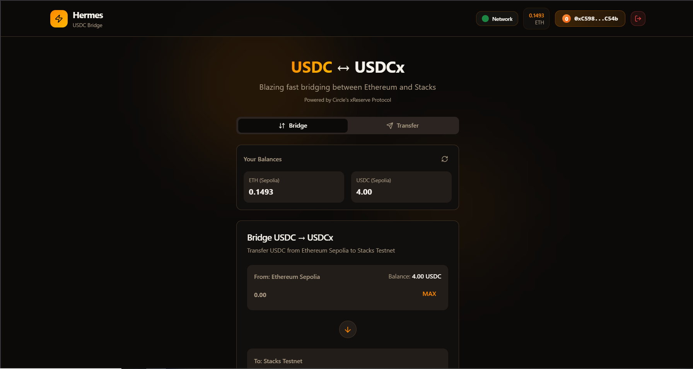
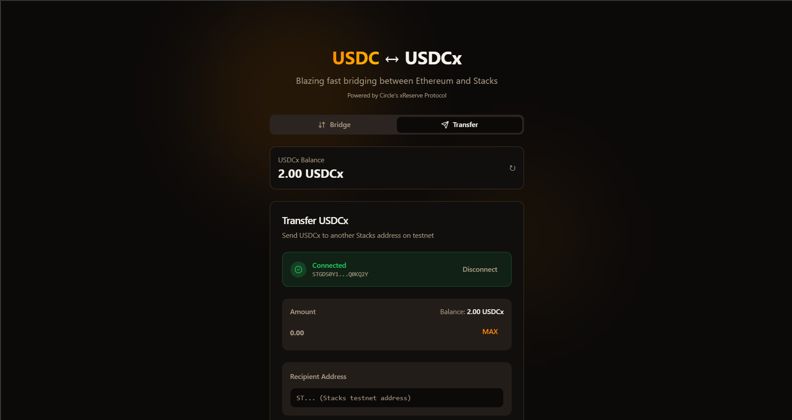
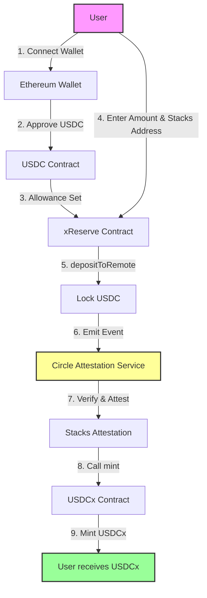
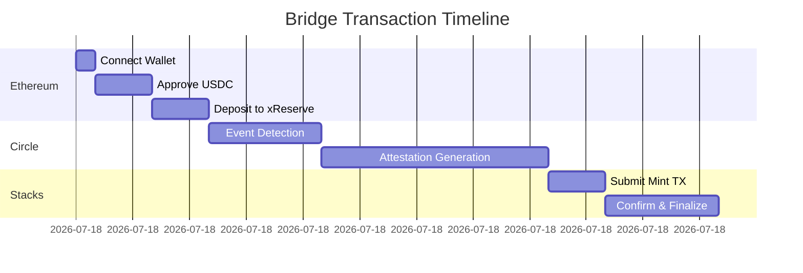
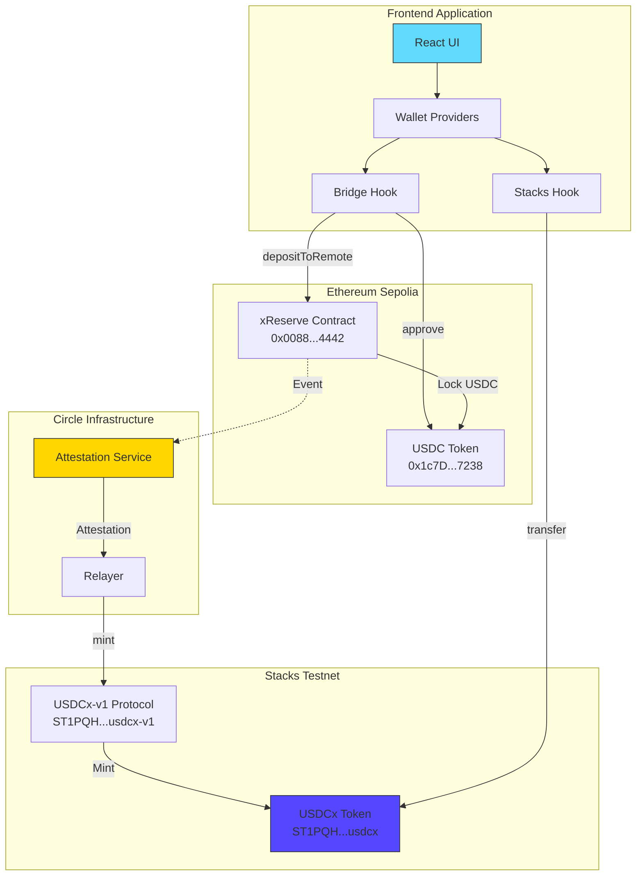
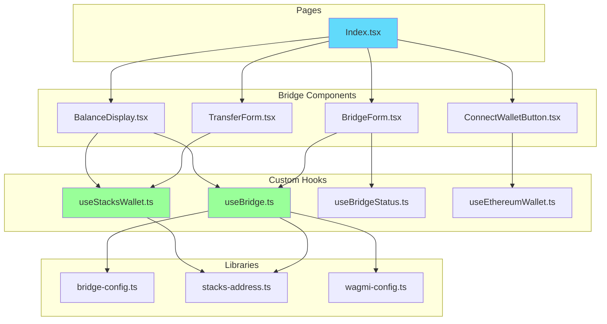
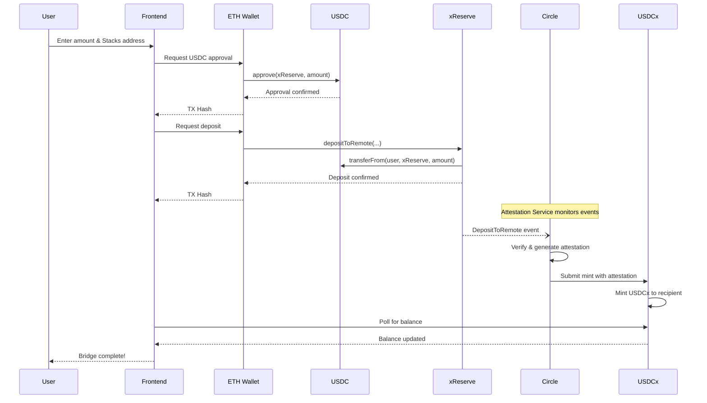
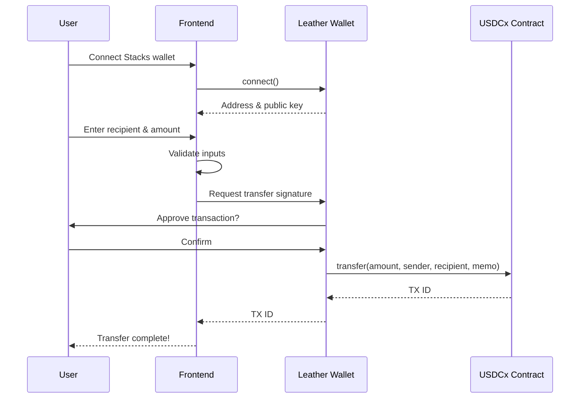

<p align="center">
  
</p>

<h1 align="center">Hermes Bridge</h1>

<p align="center">
  <strong>Bridge USDC from Ethereum to Stacks & Transfer USDCx Seamlessly</strong>
</p>


<p align="center">
  <a href="https://ethereum.org">
    
  </a>
  <a href="https://www.stacks.co">
    
  </a>
  <a href="https://www.circle.com">
    
  </a>
  <a href="https://www.circle.com/en/xreserve">
    
  </a>
</p>

<p align="center">
  Hermes Bridge is a secure, production-ready cross-chain bridge enabling seamless USDC transfers between Ethereum and Stacks blockchains. It provides two core functionalities: (1) Bridge USDC from Ethereum to USDCx on Stacks via Circle's trusted xReserve protocol, and (2) Transfer USDCx between Stacks addresses with full custody and control. 
</p>

<p align="center">
  <a href="#features">Features</a> •
  <a href="#how-it-works">How It Works</a> •
  <a href="#architecture">Architecture</a> •
  <a href="#quick-start">Quick Start</a> •
  <a href="#contracts">Contracts</a> •
  <a href="#contributing">Contributing</a>
</p>

<p align="center">
  
  
  
  
  
  
</p>

---

## Table of Contents

- [Table of Contents](#table-of-contents)
- [Core Features](#core-features)
  - [Bridge Module](#bridge-module)
  - [Transfer Module](#transfer-module)
  - [Platform Features](#platform-features)
- [Bridge vs Transfer](#bridge-vs-transfer)
  - [When to Bridge (USDC → USDCx)](#when-to-bridge-usdc--usdcx)
  - [When to Transfer (USDCx → USDCx)](#when-to-transfer-usdcx--usdcx)
- [Use Cases](#use-cases)
  - [Use Case 1: Ethereum User Entering Stacks](#use-case-1-ethereum-user-entering-stacks)
  - [Use Case 2: Stacks Native User Trading](#use-case-2-stacks-native-user-trading)
  - [Use Case 3: Cross-Chain Arbitrage](#use-case-3-cross-chain-arbitrage)
- [Preview](#preview)
  - [Bridge Interface](#bridge-interface)
  - [Transfer Interface](#transfer-interface)
- [How It Works](#how-it-works)
  - [Bridge Flow (USDC → USDCx)](#bridge-flow-usdc--usdcx)
  - [Transfer Flow (USDCx → USDCx)](#transfer-flow-usdcx--usdcx)
  - [Bridge Timeline](#bridge-timeline)
- [Architecture](#architecture)
  - [System Overview](#system-overview)
  - [Component Architecture](#component-architecture)
  - [Sequence Diagrams](#sequence-diagrams)
    - [Bridge Deposit Sequence](#bridge-deposit-sequence)
    - [USDCx Transfer Sequence](#usdcx-transfer-sequence)
- [Quick Start](#quick-start)
  - [Prerequisites](#prerequisites)
  - [Get Testnet Tokens](#get-testnet-tokens)
  - [Mobile Wallet Support](#mobile-wallet-support)
  - [Installation](#installation)
  - [Development](#development)
  - [Production Build](#production-build)
- [Smart Contracts](#smart-contracts)
  - [Ethereum Contracts (Sepolia Testnet)](#ethereum-contracts-sepolia-testnet)
  - [Stacks Contracts (Testnet)](#stacks-contracts-testnet)
  - [Contract Interactions](#contract-interactions)
    - [1. Approve USDC (Ethereum)](#1-approve-usdc-ethereum)
    - [2. Deposit to Remote / Bridge (Ethereum)](#2-deposit-to-remote--bridge-ethereum)
    - [3. Encode Stacks Address for Ethereum](#3-encode-stacks-address-for-ethereum)
    - [4. Transfer USDCx (Stacks)](#4-transfer-usdcx-stacks)
    - [5. Check USDCx Balance (Stacks)](#5-check-usdcx-balance-stacks)
- [Configuration](#configuration)
  - [Bridge Configuration](#bridge-configuration)
  - [USDCx Contract Configuration](#usdcx-contract-configuration)
- [Project Structure](#project-structure)
- [Testing](#testing)
  - [Manual Testing Checklist](#manual-testing-checklist)
    - [Bridge Flow](#bridge-flow)
    - [Transfer Flow](#transfer-flow)
- [Deployment](#deployment)
  - [Vercel (Recommended)](#vercel-recommended)
  - [Netlify](#netlify)
  - [Docker](#docker)
- [Contributing](#contributing)
  - [Development Guidelines](#development-guidelines)
- [License](#license)
- [Support](#support)
- [Resources](#resources)

---

## Core Features



### Bridge Module
| Feature | Description |
|---------|-------------|
| **USDC → USDCx Bridge** | Atomic cross-chain transfers from Ethereum to Stacks |
| **Circle xReserve Integration** | Industry-standard attestation-based bridging |
| **Approval-based Flow** | Secure two-step process (approve, then deposit) |
| **Address Encoding** | Automatic Stacks address encoding for Ethereum contracts |
| **Live Status Tracking** | Monitor bridge status through attestation service |

### Transfer Module
| Feature | Description |
|---------|-------------|
| **Native USDCx Transfers** | Direct transfers between Stacks addresses |
| **Custody & Control** | Full control of your USDCx tokens |
| **Single-Step Transactions** | Fast, simple peer-to-peer transfers |
| **Balance Verification** | Real-time balance checks before transfer |
| **Post-Conditions** | Enhanced security with transaction post-conditions |

### Platform Features
| Feature | Description |
|---------|-------------|
| **Multi-Wallet Support** | MetaMask, Coinbase Wallet, WalletConnect, Leather |
| **Dual-Chain Interface** | Unified UI for both Ethereum and Stacks operations |
| **Real-Time Tracking** | Live transaction status and balance updates |
| **Modern UI/UX** | Beautiful, responsive interface with dark mode |
| **Optimized Performance** | Built with Vite for blazing fast load times |
| **Secure & Reliable** | Powered by Circle's trusted xReserve protocol |

---

## Bridge vs Transfer

### When to Bridge (USDC → USDCx)

**Use the Bridge feature when:**
- You want to move USDC from Ethereum to Stacks
- You need to access Stacks DeFi opportunities
- Converting stablecoins to USDCx for cross-chain operations
- Leveraging Circle's attestation infrastructure

**Bridge Characteristics:**
- Requires ETH in wallet for gas fees
- 5-30 minute attestation window
- Atomic transaction: approve + deposit in one flow
- Powered by Circle's xReserve contract
- Addresses are encoded for cross-chain compatibility

### When to Transfer (USDCx → USDCx)

**Use the Transfer feature when:**
- You already have USDCx on Stacks
- Sending USDCx to other Stacks addresses
- Direct peer-to-peer payments on Stacks
- Requiring instant confirmation

**Transfer Characteristics:**
- Fast confirmation (12-15 seconds)
- Only requires STX for gas fees
- Simple recipient address input
- Native Stacks smart contract call
- Ideal for DeFi operations and payments



---

## Use Cases

### Use Case 1: Ethereum User Entering Stacks
```
Ethereum Wallet (USDC) → Bridge → Stacks Wallet (USDCx)
Flow: Connect MetaMask → Approve USDC → Enter Stacks Address → Bridge
Time: ~20 minutes | Network: Ethereum Sepolia + Stacks Testnet
```

### Use Case 2: Stacks Native User Trading
```
Your Stacks Wallet (USDCx) → Transfer → Other Stacks Address (USDCx)
Flow: Connect Leather → Enter Recipient → Enter Amount → Transfer
Time: ~15 seconds | Network: Stacks Testnet only
```

### Use Case 3: Cross-Chain Arbitrage
```
Ethereum (USDC) → Bridge to Stacks (USDCx) → Stacks DeFi → Transfer USDCx
Flow: Complete bridge → Access Stacks DeFi → Transfer profits to recipients
Time: 20-30 minutes total | Networks: Both chains
```

---

## Preview

### Bridge Interface

```
┌─────────────────────────────────────────────────────────────────┐
│                        ⚡ HERMES BRIDGE                          │
├─────────────────────────────────────────────────────────────────┤
│                                                                  │
│  ┌────────────────────────────────────────────────────────────┐ │
│  │  From: Ethereum Sepolia                                     │ │
│  │  ┌──────────────────────────────────────────────────────┐  │ │
│  │  │  Amount: [1.00                    ] USDC    [MAX]    │  │ │
│  │  │  Balance: 100.00 USDC                                │  │ │
│  │  └──────────────────────────────────────────────────────┘  │ │
│  └────────────────────────────────────────────────────────────┘ │
│                              ⬇️                                  │
│  ┌────────────────────────────────────────────────────────────┐ │
│  │  To: Stacks Testnet                                         │ │
│  │  ┌──────────────────────────────────────────────────────┐  │ │
│  │  │  Recipient: [ST1ABC...XYZ                          ] │  │ │
│  │  └──────────────────────────────────────────────────────┘  │ │
│  └────────────────────────────────────────────────────────────┘ │
│                                                                  │
│  ┌────────────────────────────────────────────────────────────┐ │
│  │                  [ 🚀 Bridge to Stacks ]                    │ │
│  └────────────────────────────────────────────────────────────┘ │
│                                                                  │
└─────────────────────────────────────────────────────────────────┘
```

### Transfer Interface

```
┌─────────────────────────────────────────────────────────────────┐
│                        TRANSFER USDCx                            │
├─────────────────────────────────────────────────────────────────┤
│                                                                  │
│  Your Balance: 10.00 USDCx                                       │
│                                                                  │
│  ┌──────────────────────────────────────────────────────────┐   │
│  │  Amount: [5.00                        ] USDCx   [MAX]    │   │
│  └──────────────────────────────────────────────────────────┘   │
│                                                                  │
│  ┌──────────────────────────────────────────────────────────┐   │
│  │  Recipient: [ST2XYZ...ABC                              ] │   │
│  └──────────────────────────────────────────────────────────┘   │
│                                                                  │
│  ┌────────────────────────────────────────────────────────────┐ │
│  │                    [ Send USDCx ]                           │ │
│  └────────────────────────────────────────────────────────────┘ │
│                                                                  │
└─────────────────────────────────────────────────────────────────┘
```

---

## How It Works

### Bridge Flow (USDC → USDCx)



### Transfer Flow (USDCx → USDCx)



```mermaid
flowchart LR
    A[Sender] -->|1. Connect Leather| B[Stacks Wallet]
    B -->|2. Enter Recipient & Amount| C[Transfer Form]
    C -->|3. Sign Transaction| D[USDCx Contract]
    D -->|4. transfer| E[Stacks Blockchain]
    E -->|5. Confirm| F[Recipient receives USDCx]
    
    style A fill:#f9f,stroke:#333,stroke-width:2px
    style F fill:#9f9,stroke:#333,stroke-width:2px
```

### Bridge Timeline



---

## Architecture

### System Overview



### Component Architecture



### Sequence Diagrams

#### Bridge Deposit Sequence



#### USDCx Transfer Sequence



---

## Quick Start

### Prerequisites

| Requirement | Version | Description |
|-------------|---------|-------------|
| **Node.js** | >= 18.0.0 | JavaScript runtime |
| **pnpm** | >= 8.0.0 | Package manager (recommended) |
| **MetaMask** | Latest | Ethereum wallet |
| **Leather** | Latest | Stacks wallet |

### Get Testnet Tokens

| Token | Faucet | Network |
|-------|--------|---------|
| **Sepolia ETH** | [Google Cloud Faucet](https://cloud.google.com/application/web3/faucet/ethereum/sepolia) | Ethereum Sepolia |
| **Testnet USDC** | [Circle Faucet](https://faucet.circle.com/) | Ethereum Sepolia |
| **Testnet STX** | [Stacks Faucet](https://explorer.hiro.so/sandbox/faucet?chain=testnet) | Stacks Testnet |

### Mobile Wallet Support

**For mobile browsers to connect wallets properly:**

1. **HTTPS Required**: WalletConnect requires HTTPS in production. Deploy to Vercel/Netlify for automatic HTTPS.
2. **WalletConnect Project**: Ensure your WalletConnect project is configured with:
   - Correct app URL (`https://your-domain.com`)
   - App icon (use `/hermes-logo.svg`)
   - Description: "Cross-chain USDC bridge between Ethereum and Stacks"
3. **Supported Wallets**:
   - **Ethereum**: MetaMask, Coinbase Wallet, Trust Wallet, Rainbow
   - **Stacks**: Leather Wallet (mobile app)
4. **Mobile Browsers**: Works best in Safari (iOS), Chrome (Android)

**Testing Mobile Wallets:**
- Use your phone's browser to access the deployed app
- Scan QR codes with wallet apps
- Ensure popups are not blocked
- Try both portrait and landscape orientations

### Installation

```bash
# Clone the repository
git clone https://github.com/yourusername/hermes-bridge.git
cd hermes-bridge

# Install dependencies
pnpm install
```

### Development

```bash
# Start development server
pnpm dev

# App available at http://localhost:5173
```

### Production Build

```bash
# Build for production
pnpm build

# Preview production build
pnpm preview

# Type checking
pnpm exec tsc --noEmit

# Linting
pnpm lint
```

---

## Smart Contracts

### Ethereum Contracts (Sepolia Testnet)

| Contract | Address | Explorer |
|----------|---------|----------|
| **USDC Token** | `0x1c7D4B196Cb0C7B01d743Fbc6116a902379C7238` | [View on Etherscan](https://sepolia.etherscan.io/token/0x1c7D4B196Cb0C7B01d743Fbc6116a902379C7238) |
| **xReserve** | `0x008888878f94C0d87defdf0B07f46B93C1934442` | [View on Etherscan](https://sepolia.etherscan.io/address/0x008888878f94C0d87defdf0B07f46B93C1934442) |

### Stacks Contracts (Testnet)

| Contract | Address | Explorer |
|----------|---------|----------|
| **USDCx Token** | `ST1PQHQKV0RJXZFY1DGX8MNSNYVE3VGZJSRTPGZGM.usdcx` | [View on Explorer](https://explorer.hiro.so/txid/ST1PQHQKV0RJXZFY1DGX8MNSNYVE3VGZJSRTPGZGM.usdcx?chain=testnet) |
| **USDCx Protocol** | `ST1PQHQKV0RJXZFY1DGX8MNSNYVE3VGZJSRTPGZGM.usdcx-v1` | [View on Explorer](https://explorer.hiro.so/txid/ST1PQHQKV0RJXZFY1DGX8MNSNYVE3VGZJSRTPGZGM.usdcx-v1?chain=testnet) |

### Contract Interactions

#### 1. Approve USDC (Ethereum)

```typescript
import { parseUnits } from 'viem';

// ABI for ERC-20 approve
const ERC20_ABI = [
  {
    name: "approve",
    type: "function",
    stateMutability: "nonpayable",
    inputs: [
      { name: "spender", type: "address" },
      { name: "amount", type: "uint256" },
    ],
    outputs: [{ name: "success", type: "bool" }],
  },
];

// Approve xReserve to spend USDC
await walletClient.writeContract({
  address: "0x1c7D4B196Cb0C7B01d743Fbc6116a902379C7238", // USDC
  abi: ERC20_ABI,
  functionName: "approve",
  args: [
    "0x008888878f94C0d87defdf0B07f46B93C1934442", // xReserve
    parseUnits("100", 6) // 100 USDC (6 decimals)
  ],
});
```

#### 2. Deposit to Remote / Bridge (Ethereum)

```typescript
import { parseUnits } from 'viem';
import { encodeStacksAddress } from './stacks-address';

// ABI for xReserve depositToRemote
const X_RESERVE_ABI = [
  {
    name: "depositToRemote",
    type: "function",
    stateMutability: "nonpayable",
    inputs: [
      { name: "value", type: "uint256" },
      { name: "remoteDomain", type: "uint32" },
      { name: "remoteRecipient", type: "bytes32" },
      { name: "localToken", type: "address" },
      { name: "maxFee", type: "uint256" },
      { name: "hookData", type: "bytes" },
    ],
    outputs: [],
  },
];

// Bridge USDC to Stacks
const stacksRecipient = "ST1ABC...XYZ"; // Stacks testnet address
const encodedRecipient = encodeStacksAddress(stacksRecipient);

await walletClient.writeContract({
  address: "0x008888878f94C0d87defdf0B07f46B93C1934442", // xReserve
  abi: X_RESERVE_ABI,
  functionName: "depositToRemote",
  args: [
    parseUnits("1.0", 6),           // 1 USDC (6 decimals)
    10003,                           // Stacks domain ID (constant)
    encodedRecipient,                // bytes32 encoded Stacks address
    "0x1c7D4B196Cb0C7B01d743Fbc6116a902379C7238", // USDC token
    0n,                              // maxFee (0 for testnet)
    "0x",                            // hookData (empty)
  ],
});
```

#### 3. Encode Stacks Address for Ethereum

```typescript
import * as P from 'micro-packed';
import { createAddress } from '@stacks/transactions';
import { hex } from '@scure/base';
import { toHex, pad, type Hex } from 'viem';

// Encoder for Stacks address to bytes32
export const remoteRecipientCoder = P.wrap<string>({
  encodeStream(w, value: string) {
    const address = createAddress(value);
    // 11 zero bytes padding
    P.bytes(11).encodeStream(w, new Uint8Array(11).fill(0));
    // 1 version byte
    P.U8.encodeStream(w, address.version);
    // 20 hash160 bytes
    P.bytes(20).encodeStream(w, hex.decode(address.hash160));
  },
  decodeStream(r) {
    P.bytes(11).decodeStream(r);
    const version = P.U8.decodeStream(r);
    const hash = P.bytes(20).decodeStream(r);
    return addressToString({
      hash160: hex.encode(hash),
      version: version as AddressVersion,
      type: StacksWireType.Address,
    });
  },
});

export function encodeStacksAddress(stacksAddress: string): Hex {
  const encoded = remoteRecipientCoder.encode(stacksAddress);
  return toHex(pad(encoded, { size: 32 }));
}

// Example
const encoded = encodeStacksAddress("ST1PQHQKV0RJXZFY1DGX8MNSNYVE3VGZJSRTPGZGM");
// Returns: 0x0000000000000000000000001a...
```

#### 4. Transfer USDCx (Stacks)

```typescript
import { request } from '@stacks/connect';
import { Cl } from '@stacks/transactions';

// Transfer USDCx using @stacks/connect v8
const response = await request('stx_callContract', {
  contract: 'ST1PQHQKV0RJXZFY1DGX8MNSNYVE3VGZJSRTPGZGM.usdcx',
  functionName: 'transfer',
  functionArgs: [
    Cl.uint(1000000n),                              // 1 USDCx (6 decimals)
    Cl.principal('ST1ABC...sender'),                // sender
    Cl.principal('ST2XYZ...recipient'),             // recipient
    Cl.none(),                                      // memo (optional)
  ],
  network: 'testnet',
});

console.log('Transaction ID:', response.txid);
```

#### 5. Check USDCx Balance (Stacks)

```typescript
// Fetch balance from Hiro API
const address = 'ST1ABC...XYZ';
const response = await fetch(
  `https://api.testnet.hiro.so/extended/v1/address/${address}/balances`
);
const data = await response.json();

// Extract USDCx balance
const usdcxKey = 'ST1PQHQKV0RJXZFY1DGX8MNSNYVE3VGZJSRTPGZGM.usdcx::usdcx-token';
const balanceRaw = data.fungible_tokens?.[usdcxKey]?.balance || '0';
const balanceFormatted = (parseInt(balanceRaw) / 1_000_000).toFixed(6);

console.log(`USDCx Balance: ${balanceFormatted}`);
```

---

## Configuration

### Bridge Configuration

Located in `src/lib/bridge-config.ts`:

```typescript
export const BRIDGE_CONFIG = {
  // Ethereum Sepolia contracts
  X_RESERVE_CONTRACT: "0x008888878f94C0d87defdf0B07f46B93C1934442",
  ETH_USDC_CONTRACT: "0x1c7D4B196Cb0C7B01d743Fbc6116a902379C7238",
  
  // Stacks domain ID (constant for all networks)
  STACKS_DOMAIN: 10003,
  
  // RPC endpoint
  ETH_RPC_URL: "https://ethereum-sepolia.publicnode.com",
  
  // Chain ID
  CHAIN_ID: 11155111, // Sepolia
};
```

### USDCx Contract Configuration

Located in `src/hooks/useStacksWallet.ts`:

```typescript
const USDCX_CONTRACT = {
  address: 'ST1PQHQKV0RJXZFY1DGX8MNSNYVE3VGZJSRTPGZGM',
  name: 'usdcx',
  assetName: 'usdcx-token',
};
```

---

## Project Structure

```
hermes-bridge/
├── public/
│   ├── hermes-logo.svg          # App logo
│   ├── og-image.png             # Social media preview
│   └── robots.txt               # SEO configuration
├── src/
│   ├── components/
│   │   ├── bridge/
│   │   │   ├── BridgeForm.tsx        # Main bridge UI component
│   │   │   ├── TransferForm.tsx      # USDCx transfer UI
│   │   │   ├── BalanceDisplay.tsx    # Wallet balance cards
│   │   │   └── ConnectWalletButton.tsx
│   │   └── ui/                       # shadcn/ui components
│   ├── hooks/
│   │   ├── useBridge.ts              # Ethereum bridge logic
│   │   ├── useBridgeStatus.ts        # Bridge status tracking
│   │   ├── useStacksWallet.ts        # Stacks wallet (@stacks/connect)
│   │   └── useEthereumWallet.ts      # Ethereum wallet hooks
│   ├── lib/
│   │   ├── bridge-config.ts          # Contract addresses & config
│   │   ├── stacks-address.ts         # Address encoding utilities
│   │   ├── wagmi-config.ts           # Wagmi/RainbowKit setup
│   │   └── utils.ts                  # Helper functions
│   ├── pages/
│   │   ├── Index.tsx                 # Main page
│   │   └── NotFound.tsx              # 404 page
│   ├── App.tsx                       # App entry point
│   ├── main.tsx                      # React entry point
│   └── index.css                     # Global styles (Tailwind)
├── index.html                        # HTML template
├── package.json                      # Dependencies
├── vite.config.ts                    # Vite configuration
├── tailwind.config.ts                # Tailwind configuration
└── tsconfig.json                     # TypeScript configuration
```

---

## Testing

```bash
# Run unit tests
pnpm test

# Run tests in watch mode
pnpm test:watch
```

### Manual Testing Checklist

#### Bridge Flow
- [ ] Connect Ethereum wallet (MetaMask)
- [ ] Verify USDC balance displays correctly
- [ ] Approve USDC spending for xReserve
- [ ] Execute bridge deposit with valid Stacks address
- [ ] Verify transaction confirmed on Etherscan
- [ ] Wait for Circle attestation (5-30 minutes)
- [ ] Verify USDCx received on Stacks Explorer

#### Transfer Flow
- [ ] Connect Stacks wallet (Leather)
- [ ] Verify USDCx balance displays correctly
- [ ] Enter valid recipient Stacks address
- [ ] Execute USDCx transfer
- [ ] Verify transaction on Stacks Explorer

---

## Deployment

### Vercel (Recommended)

```bash
# Install Vercel CLI
npm i -g vercel

# Deploy to preview
vercel

# Deploy to production
vercel --prod
```

### Netlify

1. Build the project: `pnpm build`
2. Deploy the `dist/` folder to Netlify

### Docker

```dockerfile
# Dockerfile
FROM node:18-alpine AS builder
WORKDIR /app
RUN npm install -g pnpm
COPY package.json pnpm-lock.yaml ./
RUN pnpm install --frozen-lockfile
COPY . .
RUN pnpm build

FROM nginx:alpine
COPY --from=builder /app/dist /usr/share/nginx/html
EXPOSE 80
CMD ["nginx", "-g", "daemon off;"]
```

```bash
# Build and run
docker build -t hermes-bridge .
docker run -p 8080:80 hermes-bridge
```

---

## Contributing

We welcome contributions! Please follow these steps:

1. **Fork** the repository
2. **Create** a feature branch: `git checkout -b feature/amazing-feature`
3. **Commit** your changes: `git commit -m 'Add amazing feature'`
4. **Push** to the branch: `git push origin feature/amazing-feature`
5. **Open** a Pull Request

### Development Guidelines

- Follow the existing code style (TypeScript strict mode)
- Write meaningful commit messages
- Add tests for new features
- Update documentation as needed
- Ensure `pnpm exec tsc --noEmit` passes
- Ensure `pnpm lint` passes

---

## License

This project is licensed under the MIT License - see the [LICENSE](LICENSE) file for details.

---

## Support

If you find Hermes Bridge helpful, consider supporting development:

<p align="center">
  <strong>Stacks Donation Address</strong>
</p>

```
SP2F70QJ9J57YSSZE76KC1A3X718ADXSZPG8581EP
```

---

## Resources

| Resource | Link |
|----------|------|
| **Circle xReserve Docs** | [circle.com/en/xreserve](https://www.circle.com/en/xreserve) |
| **Stacks Documentation** | [docs.stacks.co](https://docs.stacks.co) |
| **@stacks/connect** | [stacks.js documentation](https://docs.stacks.co/stacks.js) |
| **Wagmi Documentation** | [wagmi.sh](https://wagmi.sh) |
| **RainbowKit** | [rainbowkit.com](https://www.rainbowkit.com) |
| **Viem** | [viem.sh](https://viem.sh) |

---

<p align="center">
  <strong>Built with ❤️ for the Stacks & Ethereum communities</strong>
</p>

<p align="center">
  <a href="https://www.stacks.co">Stacks</a> •
  <a href="https://ethereum.org">Ethereum</a> •
  <a href="https://www.circle.com/en/xreserve">Circle xReserve</a>
</p>
